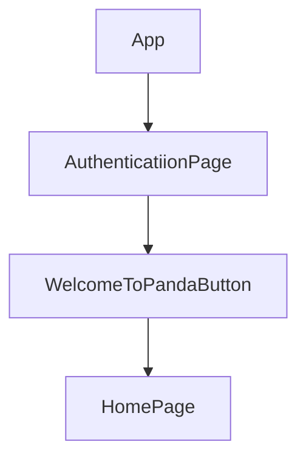

> 💻 PROJECT NAME ✨ => 💻   # Snabbtech Frontend project 
 

---
## 🔗 Profile Links✨

| Resume | Github                                                                                                                                   | Linkedin                                                                                                                                                            | Portfolio                                                                                                                                    | Blogger                                                                                                                                                           | Medium                                                                                                                                    |
| ------------- | ---------------------------------------------------------------------------------------------------------------------------------------- | ------------------------------------------------------------------------------------------------------------------------------------------------------------------- | -------------------------------------------------------------------------------------------------------------------------------------------- | -------------------------------------------------------------------------------------------------------------------------------------------- | -------------------------------------------------------------------------------------------------------------------------------------------- |
|  | |  | | | |  

---
## 💫Tech-Stack->

- #### For Frontend:-
  
   - `HTML5`
  - `CSS3`
  - `JavaScript `
  - `ReactJS`
  - `Redux`
    
 - #### For Server:-
   
   - `json-server`
     
- #### For deploy server:- 
    
   - `Render`
   
- #### For Styling:-
  
  - `Chakraui`
  
- #### For live Project: -

  - `Vercel`

  
---
## ⭕Steps to run our project:

✨Clone the repository.

✨Run the command `npm install` in both the frontend and backend folders.

✨Run the command `npm start` in the frontend folder on localhost:3000.

---
## Features ✨:-
---
 | Serial No            | Feature                                                              |
| ----------------- | ------------------------
| 1 | User Signup and login, navbar, footer|
| 2 | Home Page Design, responsive design |
| 3 | Forget password -2ui , resetPassword -2ui |

---
# Package.json(Dependency)✨:-

 | Serial No           |  Frontend      |
| ----------------- |------------------------ |
| 1 | Chakra-ui , json-server |
| 2 | React Router dom |
| 3 | redux , react-icons |
| 4 | react-redux , react-thunk |
| 6 | react-toastify , react|
| 7 | react-hot-toast  , axios|

      
💫Frontend (React.js)

  This frontend project focuses on building a user authentication system with signup, login, forget password, and password reset functionalities. Additionally, a well-designed homepage with a responsive UI, navbar, and footer is implemented. The project is structured to include routes such as /home for the homepage and / for the authentication pages.
         
---
         
## Flow

---
⭕ Steps to Use Our Project

This project showcases a straightforward authentication system  with  a React.js frontend.

#✨ Getting Started

✨ Initializing the Application

Open your terminal and navigate to the frontend directory.
Run the command npm start to launch the application locally.
Access the application through your web browser at http://localhost:3000.

✨ User Journey:-

🧑‍🏫 Authentication Pages

-- Signup
The signup page allows users to create a new account. It collects necessary information such as username, email, and password.

-- Login
The login page enables users to log in using their credentials, providing a seamless authentication process.

-- Forget Password
If users forget their password, the forget password page allows them to reset their password by providing their email address.

-- Reset Password
Users receive a password reset link via email and can use it to set a new password.

💫 Homepage
The homepage is designed to welcome users. It includes an intuitive UI with a navbar for navigation and a footer for additional information.

-- Navbar

The navbar provides easy navigation, including a link to the homepage (/home) and authentication pages (/).

-- Footer
The footer contains important links, contact information, or any other relevant details.

-- Responsive Design

The project prioritizes a responsive design, ensuring optimal user experience across various devices and screen sizes.

# Routing
 CLICK on WELCOME TO PANDA to Visit the homepage:-
     /home: Displays the homepage.
     /: Redirects to authentication pages.

# Usage

    Modify and customize the components, styles, and content to suit your project requirements. Update API endpoints and integrate with backend services as needed.
---    

✨Hosting on Vercel

     Build the React app:
     cd frontend
    npm run build
    Install Vercel CLI:
    npm install -g vercel

    
Deploy to Vercel:

     cd frontend
     vercel
    Follow the prompts to deploy your application.

Contributing

     💻 Contributions are welcome! Please follow the standard guidelines for contributing.
---

<h1 align="center">✨Thank You✨</h1>

  
